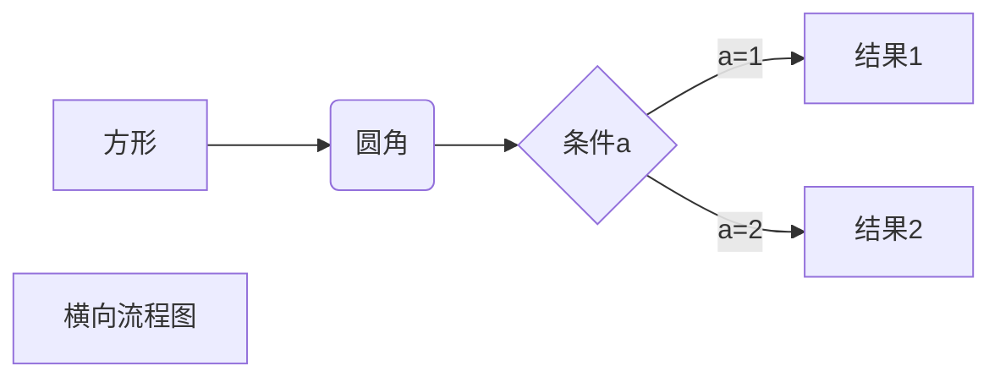
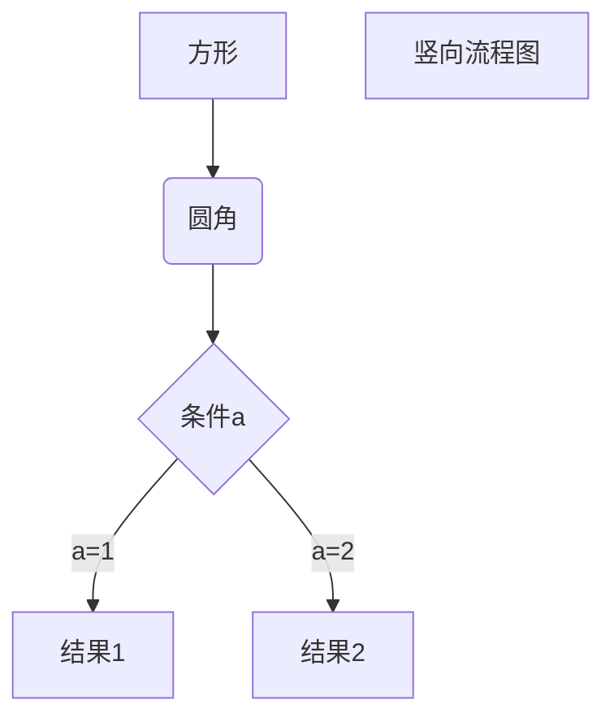
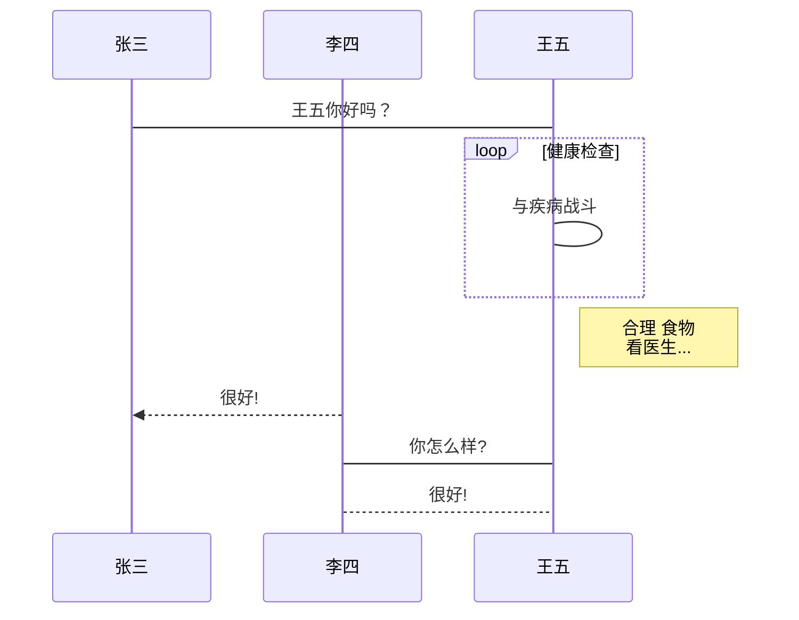
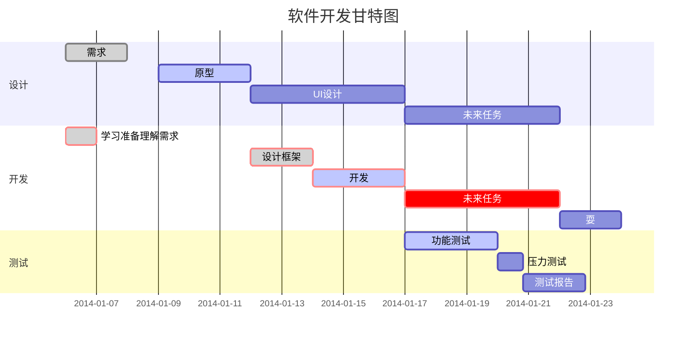

# h1 标题
## h2 标题
### h3 标题
#### h4 标题
##### h5 标题
###### h6 标题


## 水平线

测试水平线
___
---
***
测试结束
___

---

***


## 文本样式

**This is bold text**

__This is bold text__

*This is italic text*

_This is italic text_

~~Strikethrough~~

_test_  
~~test~~


## 列表

无序

+ Create a list by starting a line with `+`, `-`, or `*`
+ Sub-lists are made by indenting 2 spaces:
  - Marker character change forces new list start:
    * Ac tristique libero volutpat at
    + Facilisis in pretium nisl aliquet
    - Nulla volutpat aliquam velit
+ Very easy!

有序

1. Lorem ipsum dolor sit amet
2. Consectetur adipiscing elit
3. Integer molestie lorem at massa


1. you can use sequential number...
2. test  
 2.1. ~~test2.1~~


1. You can use sequential numbers...
1. ...or keep all the numbers as `1.`

Start numbering with offset:

57. foo
1. bar

## 区块
> test1
>> test2
>>> test3


> 1. test one
> 2. test two

> + test three
>   + test four
>     + test four


## 代码

Inline `code`

Indented code

    // Some comments
    line 1 of code
    line 2 of code
    line 3 of code


Block code "fences"

```
Sample text here...
```

Syntax highlighting

``` js
var foo = function (bar) {
  return bar++;
};

console.log(foo(5));
```

+ test  
    

    fmt.printf("test")
    
    
```

fmt.printf("test two")

```

```javascript
$(document).ready(function () {
    alert('RUNOOB');
});
```


## 链接

[baidu](www.baidu.com)

<https://www.runoob.com>


### 高级链接

这个链接用 1 作为网址变量 [Google][1]  
这个链接用 runoob 作为网址变量 [Runoob][runoob]  
[test name][3]


[1]: http://www.google.com/
[runoob]: http://www.runoob.com/
[3]: www.baidu.com


# 表格

Markdown 制作表格使用 | 来分隔不同的单元格，使用 - 来分隔表头和其他行。

语法格式如下：

```

|  表头   | 表头  |
|  ----  | ----  |
| 单元格  | 单元格 |
| 单元格  | 单元格 |

```

显示如下：

|  表头   | 表头  |
|  ----  | ----  |
| 单元格  | 单元格 |
| 单元格  | 单元格 |


| 左对齐     | 右对齐 | 居中对齐 |
| :-----     | ----: | :----: |
| 单元格1111111| 单元格1111111 | 单元格111111 |
| 单元格     | 单元格 | 单元格 |


# 高级技巧

```
支持的 HTML 元素
不在 Markdown 涵盖范围之内的标签，都可以直接在文档里面用 HTML 撰写。

目前支持的 HTML 元素有：<kbd> <b> <i> <em> <sup> <sub> <br>等 ，如：
```
使用 <kbd>Ctrl</kbd>+<kbd>Alt</kbd>+<kbd>Del</kbd> 重启电脑


## 正常显示符号

**文本加粗**   
\*\* 正常显示星号 \*\*

Markdown 支持以下这些符号前面加上反斜杠来帮助插入普通的符号：
```
\   反斜线
`   反引号
*   星号
_   下划线
{}  花括号
[]  方括号
()  小括号
#   井字号
+   加号
-   减号
.   英文句点
!   感叹号
```

### 公式
当你需要在编辑器中插入数学公式时，可以使用两个美元符 $$ 包裹 TeX 或 LaTeX 格式的数学公式来实现。提交后，问答和文章页会根据需要加载 Mathjax 对数学公式进行渲染。如：
```
$$
\mathbf{V}_1 \times \mathbf{V}_2 =  \begin{vmatrix} 
\mathbf{i} & \mathbf{j} & \mathbf{k} \\
\frac{\partial X}{\partial u} &  \frac{\partial Y}{\partial u} & 0 \\
\frac{\partial X}{\partial v} &  \frac{\partial Y}{\partial v} & 0 \\
\end{vmatrix}
$$tep1}{\style{visibility:hidden}{(x+1)(x+1)}}
$$
```

$$
\mathbf{V}_1 \times \mathbf{V}_2 =  \begin{vmatrix} 
\mathbf{i} & \mathbf{j} & \mathbf{k} \\
\frac{\partial X}{\partial u} &  \frac{\partial Y}{\partial u} & 0 \\
\frac{\partial X}{\partial v} &  \frac{\partial Y}{\partial v} & 0 \\
\end{vmatrix}
$$tep1}{\style{visibility:hidden}{(x+1)(x+1)}}
$$

### 流程图

1、横向流程图源码格式：


   
    
2、竖向流程图源码格式：


3、标准流程图源码格式：

```flow
st=>start: 开始框
op=>operation: 处理框
cond=>condition: 判断框(是或否?)
sub1=>subroutine: 子流程
io=>inputoutput: 输入输出框
e=>end: 结束框
st->op->cond
cond(yes)->io->e
cond(no)->sub1(right)->op
```
4、标准流程图源码格式（横向）：

```flow
st=>start: 开始框
op=>operation: 处理框
cond=>condition: 判断框(是或否?)
sub1=>subroutine: 子流程
io=>inputoutput: 输入输出框
e=>end: 结束框
st(right)->op(right)->cond
cond(yes)->io(bottom)->e
cond(no)->sub1(right)->op
```
5、UML时序图源码样例：

```sequence
对象A->对象B: 对象B你好吗?（请求）
Note right of 对象B: 对象B的描述
Note left of 对象A: 对象A的描述(提示)
对象B-->对象A: 我很好(响应)
对象A->对象B: 你真的好吗？
```
6、UML时序图源码复杂样例：

```sequence
Title: 标题：复杂使用
对象A->对象B: 对象B你好吗?（请求）
Note right of 对象B: 对象B的描述
Note left of 对象A: 对象A的描述(提示)
对象B-->对象A: 我很好(响应)
对象B->小三: 你好吗
小三-->>对象A: 对象B找我了
对象A->对象B: 你真的好吗？
Note over 小三,对象B: 我们是朋友
participant C
Note right of C: 没人陪我玩
```
7、UML标准时序图样例：


8、甘特图样例：




```
req, err := http.NewRequest("POST", url, body) req.Header.Add("authtoken", auth_token)
```
打印的日志如下：
```
&{POST https://restapi.getui.com/v1/hxzW1engjT6GEzDwU3YSpA/push_single HTTP/1.1 1 1 map[Authtoken:[151af1b9d4ba2d57f126b30d59b4ec585dd72d8e8980e5d63131e67478cd9702] Content-Type:[application/json]]
```
这里输出的 **Authtoken**是首字母**大写**的，并不是小写的，导致 个推 返回错误信息
```
respResult {"result":"not_auth"}
```
个推示例代码：
```
curl -H "Content-Type: application/json" \ -H "authtoken:eef0742e9bb7aa52bd1ede66a0a20c68057208656e5f558c020fb24aa5b98586" \ https://restapi.getui.com/v1/CKWfvgBDRF9aSnGrvD7IJ4/push_single \ -XPOST -d '{ "message":{ "appkey":"pMEgGQ9bgz5LVAPX8q8WH4", "is_offline":false, "msgtype":"notification" }, "notification":{ "text":"text", "title":"tttt", "transmission_type":true, "transmission_content":"透传内容" }, "cid":"1fa0795a57c863ecc9a9ea6437b8924f", "requestid":"123456789" }'
```
用curl返回结果
```
{"result":"ok", "taskid":"RASS_0109_3ed7bcb9904a2d8208261d0c78a1e999", "status":"successed_offline"}
```